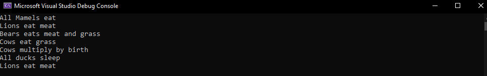

# Lab-06-07---OOP-Principles

## Problem Domain

 create a new console application that will instantiate each of your five concrete animals, and prove that they are inheriting traits/features from their various parent classes. we should use the OOP principles which are inheritance, abstraction, encapsulation, polymorphism, we shoudld also use interfaces for this project

## OOP Principles:
- Inheritance: what we mean by inheritance is that we create a new class that has all the methods and properties from the parent class. we can see that in this project when we are giving the mammels all the properties and methods of animals

-  Abstraction: When a class is abstract it means that all the children classes must have all the methods that are in the parent class and override them to their own functionality. We can see this in our project when we made the Birds class to be abstract so the child class (Duck) must have all of the abstract methods but with different functionality 

- Encapsulation: the protection level of the property or method and where we can use it in our code.

- Polymorphisem: when we create a new instance of the parent class but with the functionality of the child class.

- Interfaces:  It is like abstract class because all the methods which are declared inside the interface are abstract methods. It cannot have method body and cannot be instantiated. It is used to achieve multiple inheritance which can't be achieved by class.

 ## Visiuals 

### Output:
